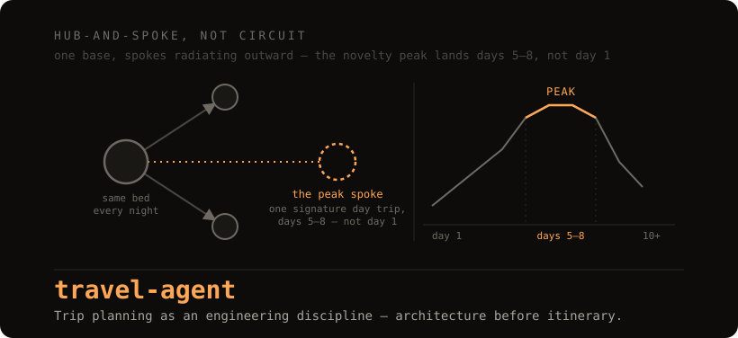

<div align="center">



<h1>travel-agent</h1>

<p><b>Trip planning as an engineering discipline: architecture before itinerary.</b><br>
Built for <a href="https://obsidian.md">Obsidian</a> + <a href="https://www.claude.com/claude-code">Claude Code</a>.<br>
Five frameworks and ten playbooks, published as the method — and an agent that runs it against your own trip instead of reasoning from scratch.</p>

[](frameworks/trip_architecture.md)
[](https://github.com/christian93kg/travel-agent/generate)


</div>

---

## Why this exists

Most trip planning starts with a list of sights and ends with an exhausting circuit — a new bed every night, a repacking tax on top of every day's decisions, and a schedule that peaks on day one because that's when the enthusiasm was highest, not because that's when the trip could actually sustain a peak. None of that is inevitable. It's the result of skipping a decision that should come before the itinerary, not after it.

|  | |
|:--:|---|
| **1** | **The architecture.** Hub-and-spoke versus circuit isn't a packing preference, it's a cognitive-load call (`frameworks/trip_architecture.md`) — one base for 5–7 nights removes the nightly check-in tax and lets sleep quality compound instead of resetting every night. |
| **2** | **The curve.** Novelty at a destination peaks around day 5–8, then adaptation sets in (`frameworks/travel_philosophy.md` §2). A trip sized against that curve, not against how many cities fit in two weeks, is the trip that's still vivid a year later. |
| **3** | **The agent.** `plan-trip` (`.claude/skills/plan-trip/`) runs intake → architecture → itinerary → threat calibration → gear delta, pulling every stage from a specific framework file instead of generic travel-blog advice — the same reasoning this repo documents, applied to your dates and your destination. |

The proof isn't the pipeline in point 3. It's what it's running — see it below, on an actual intake.

---

## Watch it plan a trip

Condensed from a real run of the skill (full transcript: [`trips/lisbon-8d/TRANSCRIPT_EXCERPT.md`](trips/lisbon-8d/TRANSCRIPT_EXCERPT.md); full output: [`trips/lisbon-8d/trip.md`](trips/lisbon-8d/trip.md)):

> **User:** Plan a trip. Solo, 8 days in Lisbon, first time in Portugal. Pure leisure, no remote work. Mid-range budget. I like some novelty but I get decision fatigue fast. Want food, walking, and one day trip. Flying in overnight from the US East Coast. I'd rather not stand out.
>
> **Agent:** Got most of what I need from that. Two gaps before I build this:
> 1. Home timezone — I'm reading "US East Coast" as US Eastern, confirm?
> 2. Any hard constraints — fixed dates, mobility limits, visa issues?
>
> **User:** Eastern's right. No hard constraints, dates are flexible.
>
> **Agent:** Locking intake. Now the architecture call.
>
> **Architecture decision:** Hub-and-spoke. Solo traveler + decision fatigue is the cognitive-load rule in `trip_architecture.md` §3 in its most literal form — no one to offload logistics onto, so every repack or check-in is executive-function spend that competes with the trip itself. One city, one stated day trip: no case for a circuit. 8 days also sits right at the top of the 5–7 night hub-sizing window (§5) — long enough for the novelty peak, not long enough to make Lisbon itself go stale before departure.

It doesn't stop at the architecture call — the same run produces a full day skeleton (decompression days 1–4, Sintra as the engineered peak on day 5, a protected departure day 8), a Tier-2 threat calibration specific to Lisbon's tram-corridor pickpocketing pattern, and a gear delta against the default capsule. Every claim in it cites the framework file — usually the exact section — it came from.

---

## What you get

| | |
|---|---|
| **`[frameworks]`** | `travel_philosophy.md` (memory dividends, the 8-day peak, the safe-cell sleep protocol) · `trip_architecture.md` (hub-and-spoke vs. circuit, the cognitive-load rule) · `adhd_travel_design.md` (novelty-cliff pacing for interest-driven brains) · `jet_lag_protocol.md` (light/temp/food circadian shifting) · `situational_awareness.md` (Cooper's Color Code + *Left of Bang* threat tiers) |
| **`[playbooks — gear]`** | `clothing_capsule.md`, `gear_kit.md`, `gear_intake_workflow.md` |
| **`[playbooks — method]`** | `working_month_method.md`, `rotation_templates.md`, `points_and_seasons.md` |
| **`[playbooks — opsec]`** | `opsec/pre_trip_opsec.md`, `opsec/in_transit_security.md`, `opsec/communication_protocols.md` |
| **`[playbooks — social]`** | `social_field_guide.md` |
| **`[skill]`** | `plan-trip` (`.claude/skills/plan-trip/`) — intake → architecture → itinerary → calibration → gear, five stages, each reading its method from a specific file above rather than reasoning freehand. `PROTOCOL.md` is the authoritative flow. |
| **`[template]`** | `trips/_template/trip.md` — the skeleton every trip gets scaffolded from: intake, architecture decision, day skeleton, threat calibration, gear delta, bookings, open questions. |
| **`[worked example]`** | `trips/lisbon-8d/` — the Lisbon run above, in full, end to end. Invented dates, no real bookings — read it before your first real trip. |

**You bring the dates and the destination. The method decides the shape.**

---

## The 8-day peak

Vacation-wellbeing research doesn't find a flat "vacation is good" curve — it finds an arc. Days 1–4 are decompression: jet lag and transit fatigue clearing, physically present but not psychologically "there" yet. Days 5–8 are where flow becomes accessible and novelty processing runs at full capacity — this is where a trip's peak actually happens. Day 9 on, the environment gets recategorized from "novel" to "known," and the same inputs stop paying off the same way.

That arc is why `trip_architecture.md` sizes a hub-and-spoke base to 5–7 nights, and why the agent protects days 5–8 for the trip's engineered peak instead of front-loading it into day 1, when a jet-lagged traveler can't actually metabolize it. It's also the argument for **pulsed, shorter trips over one long one** — four 9-day trips a year produce four separate novelty peaks; one 36-day trip produces one peak followed by a month of adaptation you already paid for. Full reasoning: [`frameworks/travel_philosophy.md`](frameworks/travel_philosophy.md) §2, [`frameworks/trip_architecture.md`](frameworks/trip_architecture.md) §5.

---

## Gear, the travel-maxxing way

The gear playbooks share one bias: buy once, carry less, and don't decide brand loyalty by vibes. Every chargeable item standardizes on USB-C input — one cable, one power bank, no legacy-cable graveyard (`playbooks/gear_kit.md`). Every candidate garment or gear slot gets scored on how many use-modes it actually covers before it earns a spot, not on how good it looks in isolation (`playbooks/clothing_capsule.md`). And undecided slots don't sit open indefinitely — `playbooks/gear_intake_workflow.md` is a batching method for researching 8–12 open decisions in one focused pass instead of one purchase-anxiety spiral at a time.

---

> [!IMPORTANT]
> This is one traveler's synthesized research, not a systematic literature review or peer-reviewed science. The frameworks cite real studies and real books, but the synthesis and the specific numbers (day counts, tier thresholds) are one person's judgment calls, not a citable standard. `situational_awareness.md` in particular is **posture heuristics, not security advice** — it will not keep you safe on its own, and it doesn't substitute for destination-specific guidance from a source that knows the current situation on the ground.

---

## Install · about 5 minutes

### 1 · Get your own copy

Click **Use this template ▸ Create a new repository** at the top of this page, name it, then clone it:

```bash
git clone https://github.com/<you>/<your-repo>.git ~/my-travel-agent
```

### 2 · Open it as an Obsidian vault

Frameworks and playbooks cross-link heavily (`[[trip_architecture]]`-style wikilinks) — opening the folder in [Obsidian](https://obsidian.md) gives you backlinks and graph view for navigating them. Plain Markdown + Claude Code alone also works; skip to step 3 if that's your setup.

### 3 · Open Claude Code in the folder

```bash
cd ~/my-travel-agent && claude
```

`CLAUDE.md` auto-loads — the read-only/editable split between `frameworks/`, `playbooks/`, and `trips/`, and the pointer to the `plan-trip` skill.

### 4 · Start

> **"Plan a trip. 8 days, Lisbon, solo."**

Claude invokes `plan-trip`, batches the remaining intake questions into one message, and builds the architecture decision, day skeleton, threat calibration, and gear delta from the frameworks above.

---

## Limitations

- **No booking integration.** The `Bookings` table in every trip file is a log, not a booking engine — flights, lodging, and reservations stay `pending` until you fill them in yourself. Nothing here calls an airline or hotel API.
- **The frameworks skew solo/independent travel.** Hub-and-spoke sizing, the decision-fatigue architecture, and the gear capsule all assume you're the one making every call. Group and family travel change the math (someone to offload logistics onto is itself a variable the cognitive-load rule doesn't model) and aren't covered.
- **Threat tiers are coarse.** Five physical tiers and four digital tiers give more resolution than most government advisories, but a single tier still collapses a lot of real variation within a country or even within a city. Treat `situational_awareness.md`'s tier as a starting posture, not a verdict — do destination-specific research before a Tier 3+ trip.
- **`adhd_travel_design.md` is a design pattern, not clinical guidance.** It applies interest-based motivation research and decision-fatigue science to trip pacing. It isn't a description of any diagnosis, and it isn't a substitute for care from a clinician who knows your specific presentation — the file says this itself.

---

## Repo layout

```
CLAUDE.md                    read-only/editable split + the plan-trip pointer — auto-loaded
_start_here.md                60-second orientation and the file map
frameworks/                   the method — 5 files, read-only reference
playbooks/                    the execution layer — 10 files, read-only reference
                                opsec/ holds the three device/comms/booking files
trips/                        where your work goes — the only directory plan-trip writes to
  _template/trip.md            the skeleton every trip is scaffolded from
  lisbon-8d/                   a worked example, full pipeline, invented dates
.claude/skills/plan-trip/     SKILL.md (pointer) + PROTOCOL.md (the actual flow)
docs/                         the hero image
NOTICE.md                     quotation/attribution policy for every cited work
LICENSE · .gitignore
```

`frameworks/trip_architecture.md` is the interesting file — read it first if you read one thing.

---

## Credits & license

- **The method.** Built on published research and books, cited by name throughout rather than summarized anonymously — see [`NOTICE.md`](NOTICE.md) for the full attribution list, including Bill Perkins' *Die With Zero* (time-bucketing, memory dividends), Jeff Cooper's Color Code, and Patrick Van Horne & Jason A. Riley's *Left of Bang* (baseline + anomaly).
- **Sibling projects** — [second-brain](https://github.com/christian93kg/second-brain), an Obsidian + Claude Code knowledge base; [brain-gym](https://github.com/christian93kg/brain-gym), a calibration-scored tutor skill; [story-loop](https://github.com/christian93kg/story-loop), interactive fiction with a craft canon and drafting gates.
- **License** — MIT, see [`LICENSE`](LICENSE)

<div align="center">
<br>

**[Read the method →](frameworks/trip_architecture.md)** · **[See the agent rules →](CLAUDE.md)**

</div>
